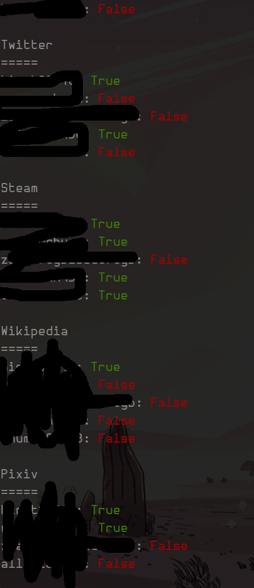

KNOCKNOCK!
====

> You should knock before enter someone's house or room.

What is knocknock?
----

TL,DR: give me some account names and I'll reveal the owner's darkest secret!

knocknock is a tool that let you briefly know a person with id, account name or
email address you can find which might belong to this guy, so you can decide
should you interest in him/her. knockknock will check if the account name
you provide could be found on a certain website service (eg. Instagram,
Soundcloud or Steam)

Why create this?
----

I'm not a social guy but I DO enjoy hanging with friends. And WOULD LIKE to make
some friends. The problem is that it's pain to me when I have to keep a
relationship with someone that I DO NOT CARE ABOUT. And guess what? You have to
spent time to examine whether you care he/her or not.

It's really boring to ask everyone you meet the same questions:

"Do you play games?"

"Do you like cats?"

"Do you listen to electronic music?"

"Do you draw silly stuff in your spare time?"

"Do you program?"

"Do you play dnd?"

...

"How about investigate a little before you meet someone face to face?"

"How about check his/her steam library first?"

"How about browse his/her bandcamp fan page first?"

So I create knocknock. Knock before you enter, or just leave without a hassle.

Installation
----

- You need `Python3` and `pip`. You might want to use `virtualenv` as well.

- Clone or download this repo.

- Install dependencies.
``` shell
# If using `virtualenv`
$ virtualenv venv && source ./venv/bin/activate

# Then
$ pip install -r ./requirements.txt
```

- Open `./knocknock` and put names you found into list named `accounts_to_test`
  (I'm really sorry about this, I'll improve usability in the next release)

- Run `knocknock`
``` shell
$ python3 ./knocknock

# Or

$ ./knocknock
```

Result example
----



Contribution
----

It's easy to support other site in knocknock(but it's hard when the site does
some tricks or ... it was poorly built).

You could check files in `./targetPages` as example. The simplest case is that
your target site provide user name searching, just use that and check the result.
Some times you can't search user name directly, but your target page will tell
you if an account has been used when you creating a new account (like Steam),
that could be useful.

In other case, do not struggle, just give up. It won't hurt.

TODO
----

- Parallelization
- Better argument interface
- Give sites groups or tags (for filtering and scoring)
- Filter sites to be run
- Support more sites or services
- Funnier result output (maybe give a **match point** between you and that guy)

License
----

knocknock - knock before you enter

This software is licensed under the [GPL v3 license][gpl].

Copyright (C) 2016 TheKK<thumbd03803@gmail.com>

[gpl]: http://www.gnu.org/copyleft/gpl.html
